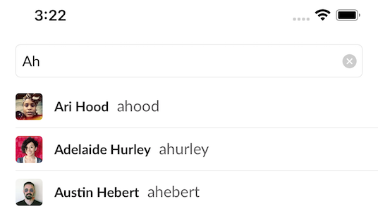

#  CodingExercise.xcodeproj



# Flows

The single use case of this coding exercise is to prefix search users by name or username.

# Non-functional Requirements

* Font scaling and dynamic type accessibility
* Offline cache for previously searched results
* Save network requests for previously searched terms with no results through a denylist

# Design

The structural architecture of this app is a lightweight MVVM with a dependency container for constructing view controllers and view models. The view controller sends messages on user interactions (i.e. when search text changes). The view model delegates state and model changes back to the view controller.

Fetching of user search results is done through the `UserSearchResultDataProvider` which decides either:
* a search term is in the deny list and to return an empty result set (`SearchDenyList`)
* a search term is not in the deny list and to request the results from the remote API (`SlackUserSearchService`)

The `UserSearchResultDataProvider` abstracts away the idea of "remote" and "cached" data from the view layer.

The rendering of data uses the standard UIKit `UITableView` and the new-to-iOS 13 diffable data source. The diffable data source allows the user search result data set to be "applied" to the table view as a data source, instead of the table view delegates indexing into the data source.

The table view uses a custom cell (`UserTableDataCell`) through the data source to display rows in the table view. The table cell is registered and dequeued by the diffable data source `CellProvider`.

A high-level class/component diagram is shown below (excluding protocols for brevity):


## Performance

### Debouncing

When a user types in the search field, a **Combine** publisher is provided the value of the text field. The value received by the publisher is debounced (time interval configurable in`AutocompleteViewModel`) before a search is requested by the data provider.

### Caching and Storage

* The `NetworkService`, responsible for requesting and decoding JSON response payloads, has a custom `URLSessionConfiguration` that instructs a network request to reuse the `URLCache` on disk or memory if available to avoid duplicate network requests of already-loaded data. A memory and disk limit have been applied to limit the size of the cache.

* Avatar images are cached via a third-party library, [Kingfisher](https://github.com/onevcat/Kingfisher), which is imported through Swift package manager (no need to reinvent the wheel here).

* The deny list is stored in a **trie** data structure for reduced memory usage (compared to a set or array). For fast lookup of search terms in the deny list, the trie is stored in memory. When the app moves to the _inactive_ state, the trie is serialized via `JSONEncoder` to the `Data` type and stored in `UserDefaults`. When the app starts up for the first time, the initial `denylist.txt` file in the app bundle is loaded to see the deny list trie in memory and in `UserDefaults`. For example, the trie consisting of `gat`, `gal`, `gar`, `ge` is encoded to `UserDefaults` as:

    ```
    // Coding keys of `_c` => character, `_we` => word end. Short naming to save disk space. 
    "g": {
        "_c": {
            "a": {
                "_c": {
                    "t": {
                        "_c": {},
                        "_we": true
                    },
                    "l": {
                        "_c": {},
                        "_we": true
                    },
                    "r": {
                        "_c": {},
                        "_we": true
                    }
                },
                "_we": false
            },
            "e": {
                "_c": {},
                "_we": true
            },
    ```

Cache contents shown in the app container:


## Accessibility and Localization

The provided specifications for UI requirements (font sizes and weights) match when the iOS text size settings are in their default state. Otherwise, the fonts will be scaled accordingly.

All text automatically adjusts to the following accessibility settings:
* dynamic type (using `UIFontMetrics`)
* bold text (`UILegibilityWeight`)

Strings in the UI are localized using `Localizable.strings` included under `Localization/`. A `LocalizableKey` utility is used to "strongly-type" the string keys from the strings file.

## Trade-offs

* The denylist is persisted to UserDefaults when the app changes to the inactive state. This means if a user performs searches that return no results and then force quits the app, these search terms will not be persisted in the deny list. This is a tradeoff between saving CPU time spent serializing v.s. potential cache data loss.

* For simplicity (and time constraint for this exercise), there is no "expiry" date of items in the deny list. If in the future a user searches for a previously denied term which now has results on the backend, the user will not see this updated result.

* Using the `URLCache` of `URLSession` is convenient and allows offline access if a request was successful while previously online. This cache may live too long (new data may be available on the server) but it is unknown as there are no cache control response headers from the API:

    ```
    Connection: keep-alive
    Server: gunicorn/19.9.0
    Date: Sun, 27 Feb 2022 02:58:33 GMT
    Content-Type: application/json
    Content-Length: 17180
    Via: 1.1 vegur
    ```

## Potential Improvements

* Replacement for UserDefaults storage to something more secure or encrypted in case sensitive terms are entered in the search bar.
* Performance instrumentation via `MetricKit`, user interaction metric collection via a third-party library or backend.
* Implement a more robust cache eviction strategy on the denylist and `URLCache`

## Testing

* Unit tests have been added and can be run through Xcode.
* Manual testing has been done on iPhone and iPad with various font scaling sizes.

## Screenshots

### iPhone


### iPad


